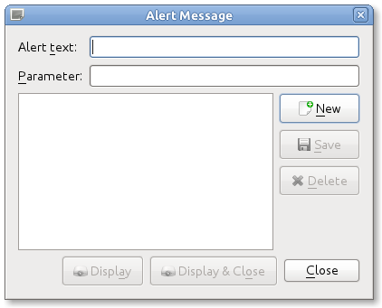

=====
Alert
=====

From time to time it may be necessary to display a small unobtrusive message to 
the congregation. In OpenLP this is known as an `Alert`. Examples could be a car 
with the headlights left on, a parent needed in nursery, or anything else 
somebody may need notified about. This is easily accomplished using the Alert, 
which is accessible from the top Menu under :menuselection:`Tools --> Alert`.

:guilabel:`Alert text:` Enter the message you want displayed in this box.

:guilabel:`Parameter:` This box is used for words you want to insert into the 
alert text.
 
You will add the Parameter text into the alert text using “<>” (without 
quotations). Anywhere in the Alert text that you add these two symbols, <> side 
by side, will insert any text you have in the parameter box into the Alert 
message.

Examples of use
---------------
 
:guilabel:`Alert text:` The owner of the vehicle with license plate number <> 
your lights are on.

:guilabel:`Parameter:` HNN432

These two settings will display like this:

The owner of the vehicle with the license plate number HNN432 your lights are on.

You could also reverse this example:

:guilabel:`Alert text:` HNN432 <>

:guilabel:`Parameter:` left their lights on.

`Will display like this:` HNN432 left their lights on.

If you use the same alerts on a regular basis, Save your Alert and you will have 
access to the alert with a click of the mouse. You may also click on `New` to 
make a new alert or `Delete` an alert you do not need.

When you are ready to Display your Alert you have two options. Clicking on 
Display will display the Alert and the Alert Message window will remain open. 
Clicking Display & Close will display the alert and close the Alert Message 
window. 

All details of the display, font, color, size and position are adjusted from the 
top Menu item :menuselection:`Settings --> Configure OpenLP`, Alert tab and the 
instructions here. :doc:`configure`

**Please note:** Alert Message is a Plugin that needs to be Active in the Plugin 
List for use.