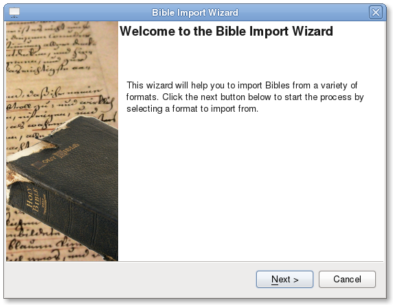
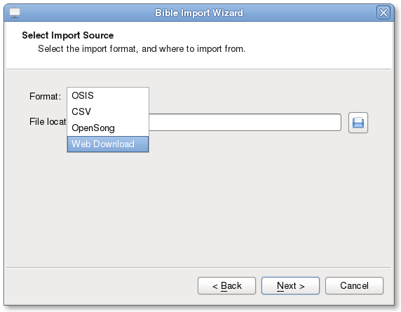
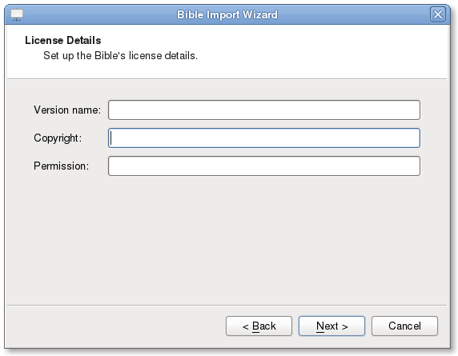
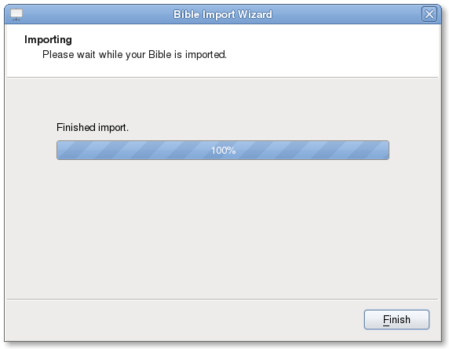
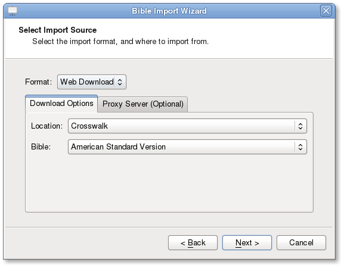
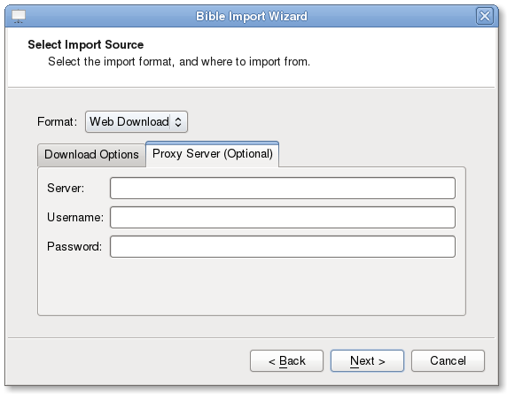
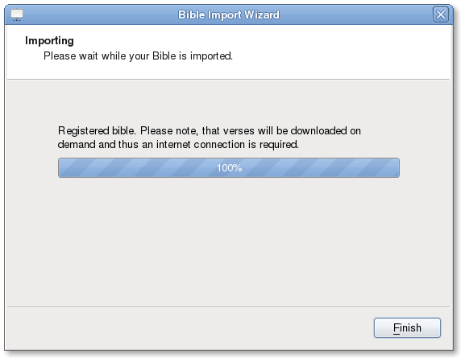
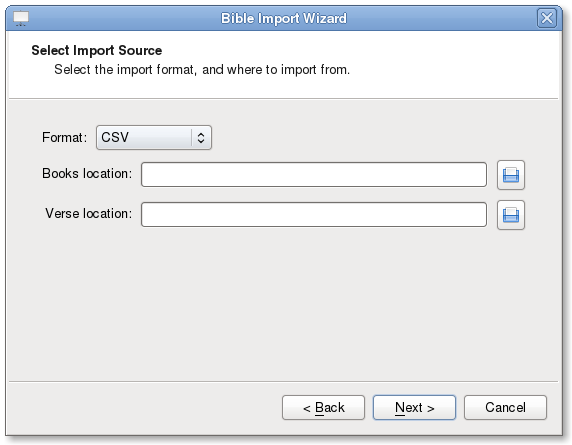

======
Bibles
======

Managing Bibles in OpenLP is a relatively simple process. There are also 
converters provided to get data from other formats into OpenLP.

Bible Importer
==============

If you are using an earlier version of OpenLP or, come from another software 
package, you may be able to convert your existing database to work in OpenLP
2.0. To access the Bible Importer :menuselection:`File --> Import --> Bible`.
You may also enter the Bible Importer by clicking the :guilabel:`Import Icon:`

You will see the Bible Importer window, click :guilabel:`Next`.

After clicking :guilabel:`Next` you can select from the various types of 
software that OpenLP will convert Bibles from.

Click on the file folder icon to choose the file of the Bible database you
want to import. See the following sections for information on the different 
formats that OpenLP will import.

Importing from OpenLP Version 1
^^^^^^^^^^^^^^^^^^^^^^^^^^^^^^^

Converting from OpenLP Version 1 is a simple process. First you will need to 
locate your Version 1 Bibles.

Windows XP::

    C:\Documents and Settings\All Users\Application Data\openlp.org\Data\Bibles\

Windows Vista / Windows 7::

    C:\ProgramData\openlp.org\Data\Bibles\

OpenLP Version 1 Bibles have the `.bible` file extension. After selecting
all of the OpenLP Version 1 Bibles you want to convert, click :guilabel:`Next` 

Enter your Bible name and copyright details. Click :guilabel:`Next`. It may
take some time to convert your Bibles so please be patient.

When the import has finished click :guilabel:`Finish` and you should be 
ready to use your OpenLP Version 1 Bibles.

Importing OSIS Bibles
^^^^^^^^^^^^^^^^^^^^^

**About OSIS Formatted Bibles**

OSIS is a format intended to provide a common format for Bibles. More
information can be found out here: http://www.bibletechnologies.net/

Importing OSIS files is very simple. Select your OSIS Bible file and click
:guilabel:`Next`

Enter you Bible name and copyright details. Click :guilabel:`Next`. It may take
some time to convert your Bibles so please be patient.

Click :guilabel:`Finish` and you should be ready to use your OpenLP Version
1 Bibles.

If you have any software installed that is part of the Sword Project 
http://www.crosswire.org/sword/index.jsp
You can easily convert Bibles from that software to OSIS format. This will work
in all platforms, but the command is case sensitive across all platforms. To
convert a Bible you would type::

    mod2osis biblename > biblename.osis

For example: if I wanted to convert a King James Version Bible I would type
something similar to this::

    mod2osis KJV > kjv.osis

You may also wish to dictate a file location for the conversion to place the 
osis file for example:: mod2osis KJV > /home/user/bibles/kjv.osis

Importing OpenSong Bibles
^^^^^^^^^^^^^^^^^^^^^^^^^

Converting from OpenSong you will need to locate your bibles database. In the 
later versions of OpenSong you are asked to define the location of this. The 
songs will be located in a folder named :guilabel:`Bibles`. This folder should
contain files with all your bibles in them without a file extension. (file.xmms).
When you have located this folder you will need to select the bible from the 
folder. 

You may also import downloaded bibles from OpenSong. The process is the same,
except you will need to extract the bible from a zip file. This is usually done
by right clicking on the downloaded file and select `Extract` or `Extract Here`.

After selecting the OpenSong Bibles you want to convert, click :guilabel:`Next` 

Enter your Bible name and copyright details. Click :guilabel:`Next`. It may
take some time to convert your Bibles so please be patient.

When the import has finished then click :guilabel:`Finish` and you should now be 
ready to use your OpenSong Bibles.

Importing Web Download Bibles
^^^^^^^^^^^^^^^^^^^^^^^^^^^^^

**About Web Download**

OpenLP provides a Web Download method to import Bibles when you do not have a
locally installed Bible available. The Web Download method registers the Bible
in OpenLP like the other bibles only it downloads the verses as you need them.
This import is not meant to be used as your sole source for Bibles, but rather
as an emergency resource and, requires an internet connection.

To use the web download feature select web download from the import wizard.

You can select from several options of location to download from and also
what Bible translation you need. You will probably want to choose the location 
from where you get the best performance or has the translation you need.

You can also select a proxy server if needed from the `Proxy Server` tab. Your
network administrator will know if this is necessary, in most cases this will
not be needed.

After selecting your download location and the Bible you wish to use, click
:guilabel:`Next` When your import is completed click :guilabel:`Finish`

You should now be ready to use the web bible.

Importing CSV formatted Bibles
^^^^^^^^^^^^^^^^^^^^^^^^^^^^^^

If you have a Bible in .csv format OpenLP can import it. CSV Bibles will
consist of two files a `books` file and a `verse` file.

Select CSV from the list of Bible types to import.

You are now ready to select your .csv files. You will need to select both your 
books and verse file location.

After you have selected the file locations you can click :guilabel:`Next`

Click :guilabel:`Finish` and you should now be ready to use your imported CSV
Bible

