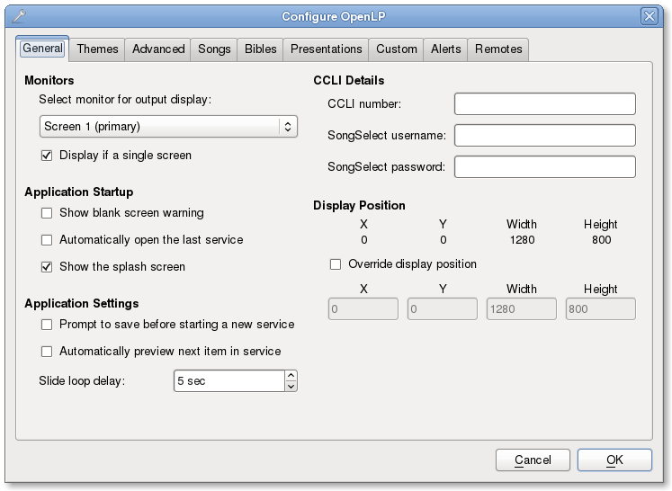
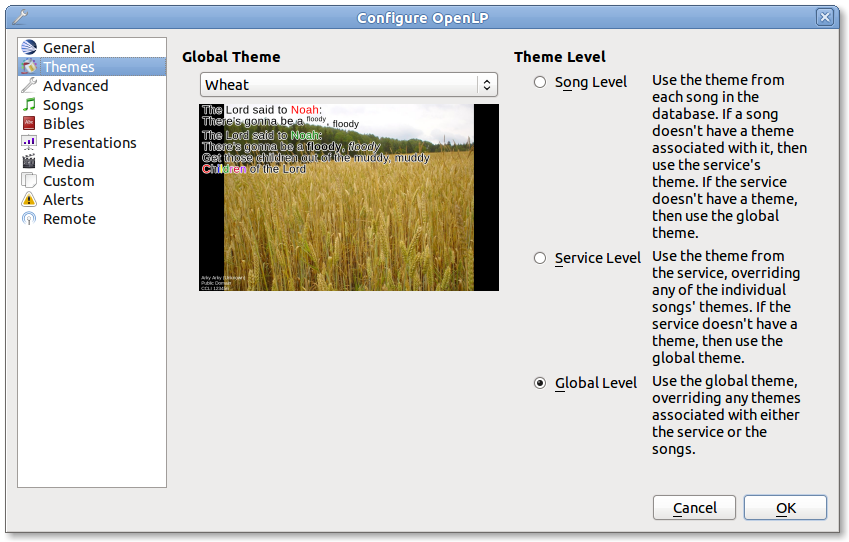
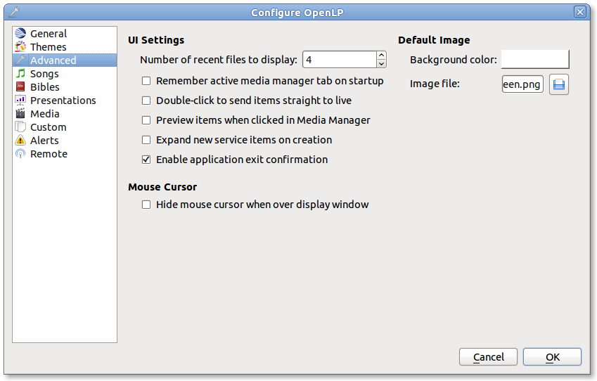
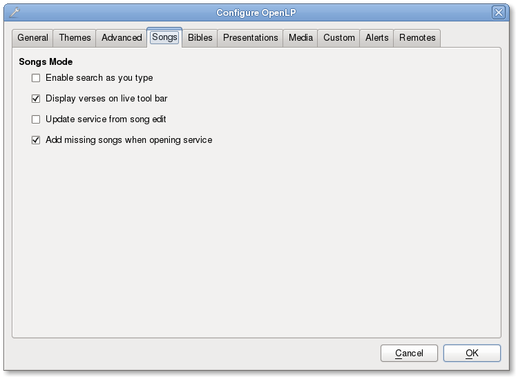
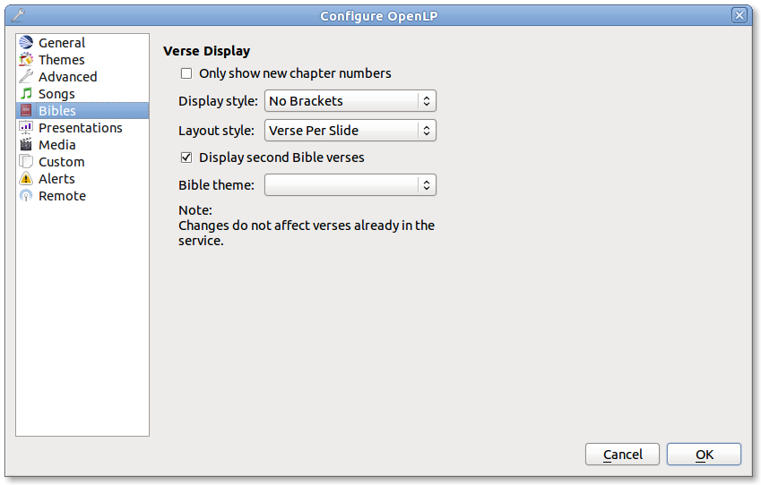
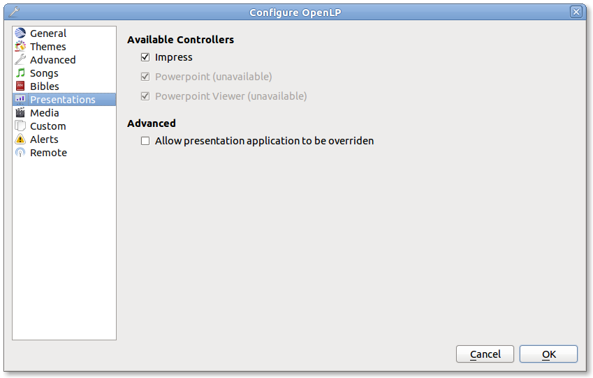
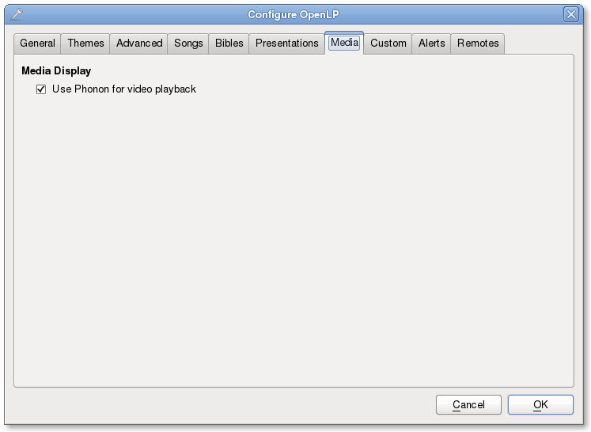
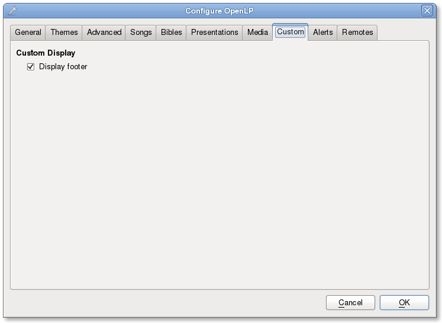
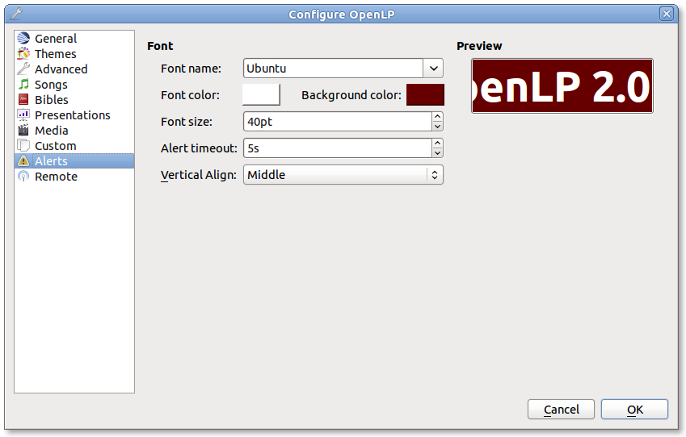
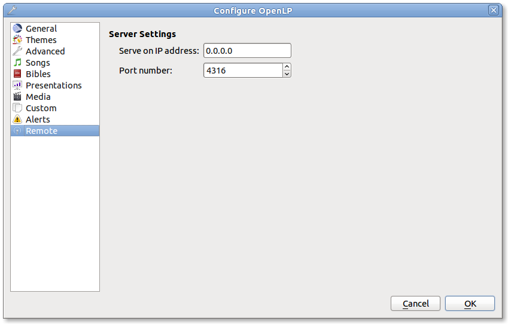

==================
Configuring OpenLP
==================

OpenLP has many options you can configure to suit your needs. Most options are
self-explanatory and we will quickly review them.

To configure OpenLP, click on :menuselection:`Settings --> Configure OpenLP...`

The plugins you have activated will have configure options. If all the plugins
are activated there will be 9 tabs across the top  you can configure.

General Tab
===========

Monitors
^^^^^^^^
To select the monitor you want to display OpenLP on, click the drop-down box 
and choose. 

Display if a single screen
^^^^^^^^^^^^^^^^^^^^^^^^^^ 

When this box is selected, you will be able to see your display on a separate 
window on the monitor you are using. Click the display and push the Esc key
on your keyboard to close the display window.
	
Application Startup
^^^^^^^^^^^^^^^^^^^

**Show blank screen warning:**

When this box is selected, you will get a warning when opening OpenLP that the 
output display has been blanked. You may have blanked it and shut down the 
program and this will warn you it is still blanked.

**Automatically open the last service:**

When this box is selected, OpenLP will remember the last service you were 
working on when you closed the program.

**Show the splash screen:**

When this box it selected, the OpenLP logo will be displayed in the center of 
the screen until the program opens. This is useful to know if the program is 
opening.

Application Settings
^^^^^^^^^^^^^^^^^^^^

**Prompt to save before starting a new service**

When this box is selected, OpenLP will prompt you to save the service you are
working on before starting a new service.

**Automatically preview next item in service**

When this box is selected, the next item in the Service Manager will show in the
Preview pane.

**Slide loop delay** 

This setting is the time delay in seconds if you want to continuously loop
images, verses, or lyrics. This control timer is also accessible on the "live 
toolbar.

CCLI Details
^^^^^^^^^^^^

**CCLI number** 

If you subscribe to CCLI, this box is for your License number. This number is
also displayed in the Song Footer box.

Display Position
^^^^^^^^^^^^^^^^
This setting will default to your computer monitor. It will override the output 
display combo box.  If your projector display is different, select the Override 
display position and make the changes here to match your projector display. This 
option also comes in handy when you have the "Display if a single screen" box 
selected. You can make the display smaller so it does not cover your whole 
screen.

Themes Tab
==========

Global Theme
^^^^^^^^^^^^
 
Choose the theme you would like to use as your default global theme from the
drop down box. The theme selected appears below. The global theme use is
determined by the Theme Level you have selected.
	
Theme Level
^^^^^^^^^^^

Choose from one of three options for the default use of your theme.

**Song Level:**

With this level selected, your theme is associated with the song. The theme is
controlled by adding or editing a song in the Song editor and  your song theme
takes priority. If your song does not have a theme associated with it, OpenLP
will use the theme set in the Service Manager.

**Service Level:** 

With this level selected, your theme is controlled at the top of the Service
Manager. Select your default service theme there. This setting will override
your Song theme. 

**Global Level:**

With this level selected, all songs and verses will use the theme selected on
the left in the Global Theme drop down.

Advanced Tab
============

UI Settings (user interface)
^^^^^^^^^^^^^^^^^^^^^^^^^^^^

**Number of recent files to display:**
 
Set this number for OpenLP to remember your last files open. These will show 
under File.

**Remember active media manager tab on startup:**
 
With this box selected OpenLP media manager will open on the same tab that it
was closed on.

**Double-click to send items straight to live:**

With this box selected, double-clicking on anything in the Media Manager will
immediately send it live instead of to Preview.

**Expand new service items on creation:**

With this box selected, everything you add to the Service Manager will be
expanded so you can see all the verses, lyrics and presentations, line by line.
When you open OpenLP, everything will automatically be expanded in the Service
Manager.

Songs Tab
=========

Songs Mode
^^^^^^^^^^

**Enable search as you type:**

With this box selected, Media Manager/Songs will display the song you are
searching for as you are typing. If this box is not selected, you need to type
in your search box and then click on the Search button.

**Display verses on live tool bar:**

With this box selected, a Go To drop down box is available on the live toolbar 
to select any part of the verse type you want displayed live. 

**Update service from song edit:**

With this box selected and you edit a song in the media manager, the results
will also change the song if it is added to the Service Manager. If this box
is not selected, your song edit changes will only be available in the Service
Manager if you add it again.

**Add missing songs when opening service:**

With this box selected, when you open an order of service created on another
computer, or if one of the songs are no longer in your Media Manager, it will
automatically enter the song in your Songs Media Manager. If this box is not 
checked, the song is available in the service but will not be added to the 
Media Manager.

Bibles Tab
==========

Verse Display
^^^^^^^^^^^^^

**Only show new chapter numbers:**

With this box selected, the live display of the verse will only show the
chapter number and verse for the first verse, and just the verse numbers after
that. If the chapter changes, the new chapter number will be displayed with the
verse number for the first line, and only the verse number displayed thereafter.

**Display style:**

This option will put brackets around the chapter and verse numbers. You may
select No Brackets or your bracket style from the drop down menu.

**Layout style:**

There are three options to determine how your Bible verses are displayed. 

`Verse Per Slide` will display one verse per slide.
`Verse Per Line` will start each verse on a new line until the slide is full.
`Continuous` will run all verses together separated by verse number and chapter
if chapter is selected to show above.

**Note: Changes do not affect verses already in the service.** 

**Display second Bible verses:**

OpenLP has the ability to display the same verse in two different Bible
versions for comparison. With this option selected, there will be a Second
choice in the Bible Media Manager to use this option. Verses will display with 
one verse per slide with the second Bible verse below.   

**Bible theme:**

You may select your default Bible theme from this drop down box. This selected
theme will only be used if your `Theme Level` is set at `Song Level`.

**Note: Changes do not affect verses already in the service.** 

Presentations Tab
=================

Available Controllers
^^^^^^^^^^^^^^^^^^^^^

OpenLP has the ability to import OpenOffice Impress or Microsoft PowerPoint
presentations, and use Impress, PowerPoint, or PowerPoint Viewer to display
them and they are controlled from within OpenLP. Please remember that in order
to use this function, you must have Impress, PowerPoint or PowerPoint Viewer
installed on your computer because OpenLP uses these programs to open and run
the presentation. You may select your default controllers here in this tab. 

Advanced
^^^^^^^^

**Allow presentation application to be overridden**

With this option selected, you will see `Present using` area with a dropdown 
box on the Presentations toolbar  in Media Manager which gives you the option 
to select the presentation program you want to use.

Media Tab
=========

Media Display
^^^^^^^^^^^^^

**Use Phonon for video playback**

If you are having trouble displaying media, selecting this box could help.

Custom Tab:
===========

Custom Display
^^^^^^^^^^^^^^

**Display Footer**

With this option selected, your Custom slide Title will be displayed in the
footer. 

**Note: If you have an entry in the Credits box of your custom slide, title and
credits will always be displayed.**

Alerts Tab
==========

Font
^^^^

**Font name:** 

Choose your desired font from the drop down menu

**Font color:**

Choose your font color here.

**Background color:** 

Choose the background color the font will be displayed on.

**Font size:** 

This will adjust the size of the font.

**Alert timeout:**

This setting will determine how long your Alert will be displayed on the screen,
in seconds.

**Location:** 

Choose the location where you want the alert displayed on the
screen, Top, Middle or Bottom.

**Preview:** 

Your choices will be displayed here.

Remote Tab
===========

OpenLP gives you the ability to control your Service Manager from a remote
computer through a web browser. This was written actually for a nursery or day 
care where a "come and get YYYY" message could be triggered remotely. It has
now become an interface to control the whole service remotely.

An example of one use for this would be if you have a missionary with a 
PowerPoint presentation, it may be easier for that missionary to remotely 
connect to your projection computer and change the slides when he wants to. 

To use this feature you will need to be on a network, wired or wireless, know
the IP address of the projection computer and enter that IP address and port 
number in the remote computer's web browser.

To find your projection computer's IP address for Windows, open Command Prompt
and type in “ipconfig” (without quotations), press Enter key and your IP
address will show. In Linux, open Terminal and type “ifconfig” (without
quotations), and use the IP address after “inet addr:” The IP address will
always have a format of xxx.xxx.xxx.xxx where x is one to three digits long.

Server Settings
^^^^^^^^^^^^^^^

Serve on IP address: Put your projection computer's IP address here. 

Port Number
^^^^^^^^^^^

You can use the default port number or change it to another number.

With these two settings written down, open a web browser in the remote computer
and enter the IP address followed by a colon and then the port number, ie: 
192.168.1.104:4316  then press enter. You should now have access to the OpenLP
Controller. If it does not come up, you either entered the wrong IP address, 
port number or one or both computer's are not connected to the network. 

