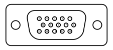
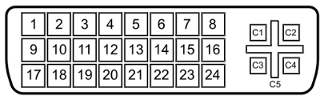
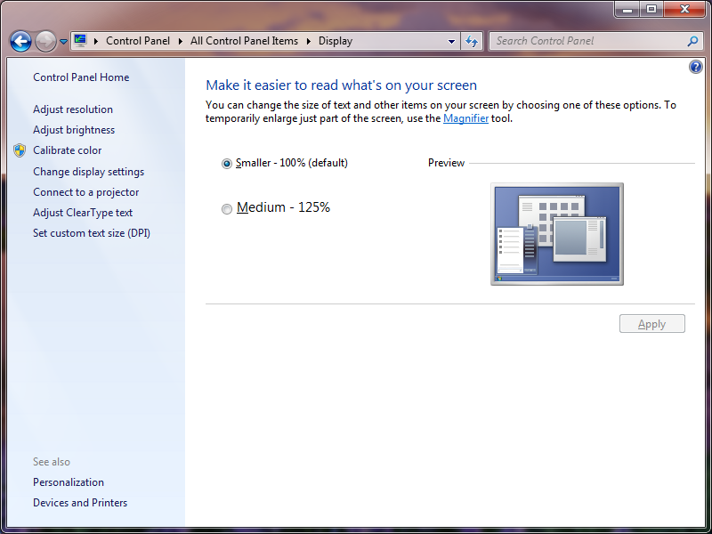
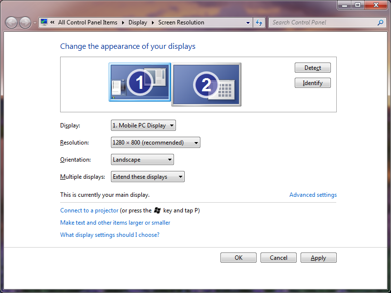
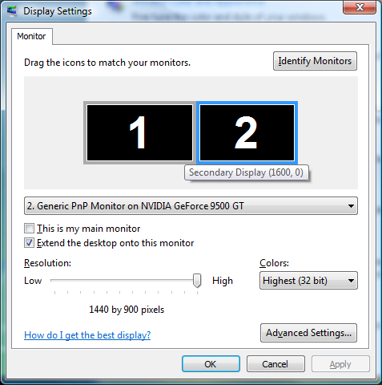
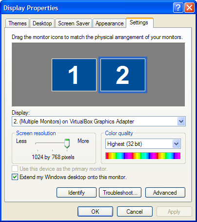
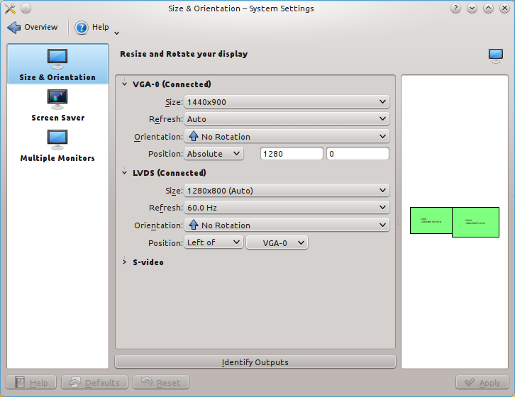
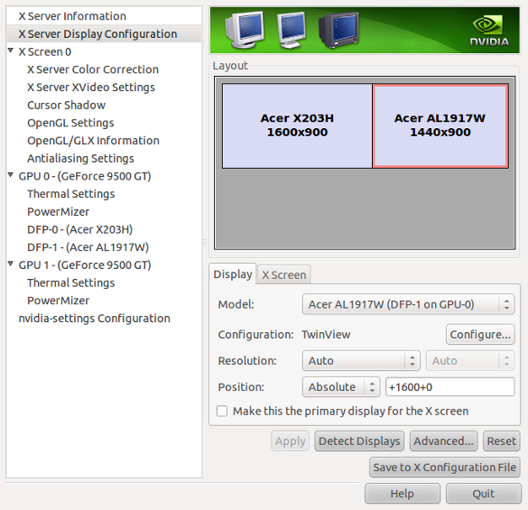
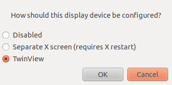

.. _dualmonitors:

==================
Dual Monitor Setup
==================

The first step in getting OpenLP working on your system is to setup your
computer properly for dual monitors. This is not very difficult, but the steps
will vary depending on operating system.

Most modern computers have the ability for dual monitors. To be certain,
check your computer's documentation. A typical desktop computer capable of dual
monitors will have two of, or a combination of the two, connectors below.

**VGA**

**DVI**

A laptop computer setup only varies slightly. Generally you will need only one
of the outputs pictured above since your laptop screen serves as one of the
monitors. Sometimes with older laptops a key stroke generally involving the
:kbd:`Fn` key and another key is required to enable the second monitor on
laptops.

Some computers also incorporate the use of :abbr:`S-Video (Separate Video)` or
:abbr:`HDMI (High-Definition Multimedia Interface)` connections.

A typical OpenLP setup consist of your normal single monitor, with your
projector hooked up to your computer as the second monitor. With the option of 
extending your desktop across the second monitor, or your operating system's 
equivalent.

**Special Note For Projectors Using USB Connections**

Users have reported experiencing difficulties when using a projector with a USB
connection. It seems that third party software many times is required to 
properly setup dual monitors. If possible, it is best to use a direct output
(VGA, DVI, HDMI, S-Video) from your machine's video card. f a USB connection is
your only option please consult the manufacturer's manual for instructions on a
proper setup.

Microsoft Windows
-----------------

Dual monitor setup is similar among all the currently supported Windows
releases (XP, Vista, Windows 7), but does vary slightly from one release to the
next.

Windows 7
^^^^^^^^^

Windows 7 has using  a projector in mind. Simply connect your projector and
press :kbd:`Windows+P`.

The more traditional way is also fairly straight forward. Go to
:guilabel:`Control Panel` and click on :guilabel:`Display`. This will open up
the :guilabel:`Display` dialog. You may also bypass this step by a right click 
on a blank area on your desktop and selecting :guilabel:`Resolution`.

Then click on the :guilabel:`Adjust resolution` link in the left pane. Enable
your projector and make sure that the selected value for :guilabel:`Multiple
displays` is :guilabel:`Extend these displays`.

Windows Vista
^^^^^^^^^^^^^

From :guilabel:`Control Panel` click on :guilabel:`Personalize`, or right click
a blank place on the desktop and click :guilabel:`Personalization`.

.. image:: pics/vistapersonalize.png

From the :guilabel:`Personalization` window click on :guilabel:`Display
Settings`. Click on the monitor that represents your projector and make sure
you have checked :guilabel:`Extend the desktop onto this monitor`.

Windows XP
^^^^^^^^^^

From :guilabel:`Control Panel` select :guilabel:`Display`, or right click on a
blank area of the desktop and select :guilabel:`Properties`. From the
:guilabel:`Display Properties` window click on the :guilabel:`Settings` tab.
Click on the monitor that represents your projector and make sure you have
checked :guilabel:`Extend my Windows desktop onto this monitor`.

Linux
-----

Due to the vast varieties of hardware, distributions, desktops, and drivers
this is not an exhaustive guide to dual monitor setup on Linux. This guide
assumes you have properly set up any proprietary drivers if needed. You
should seek out your distributions documentation if this general guide does not
work.

GNOME
^^^^^

This guide is for users of the GNOME desktop who do not use proprietary drivers.
From most distros go to :menuselection:`System --> Preferences --> Display
Settings (Monitors)`. Set up your projector with the correct resolution and make
sure that :guilabel:`Same image on all monitors` is **unchecked**.

.. image:: pics/gnome.png

KDE
^^^

This guide is for users of the KDE desktop who do not use proprietary drivers.
From most distros click the Kick Off menu and navigate to
:guilabel:`System Settings`

.. image:: pics/kdesystemsettings.png

Click on the display and monitor icon.

From here you will need to set up your projector with the appropriate
resolution, and position. OpenLP works best projecting to the monitor on the
right.

Linux Systems Using nVidia Drivers
^^^^^^^^^^^^^^^^^^^^^^^^^^^^^^^^^^

This guide is for users of the proprietary nVidia driver on Linux Distributions.
It is assumed that you have properly setup your drivers according to your
distribution's documentation, and you have a working ``xorg.conf`` file in 
place.

If you wish to make the changes permanent in setting up your system for dual
monitors it will be necessary to modify your ``xorg.conf`` file. It is always a
good idea to make a backup of any critical file before making changes::

  user@linux:~ $ sudo cp /etc/X11/xorg.conf /etc/X11/xorg.conf.old

Or for those using systems that use the root user instead of sudo, change to
root and enter::

  root@linux: # cp /etc/X11/xorg.conf /etc/X11/xorg.conf.old

The exact location of the ``xorg.conf`` file can vary so check your
distribution's documentation.

If you want to make your changes permanent run nVidia settings from the
terminal::

  user@linux:~ $ sudo nvidia-settings

Or, as root::

  root@linux: # nividia-settings

If you do not want to write the changes to your ``xorg.conf`` file simply run
the nVidia Settings program (:command:`nvidia-settings`) from your desktop's
menu, usually in an administration or system menu, or from the terminal as a
normal user run::

 user@linux:~ $ nvidia-settings

Once you have opened nVidia Settings, click on :guilabel:`X Server Display
Configuration`. Then select the monitor you are wanting to use as your second
monitor and click :guilabel:`Configure`.

After clicking :guilabel:`Configure`, select :guilabel:`TwinView`. Then click
:guilabel:`OK`.

Click :guilabel:`Apply` and if you are happy with the way things look click
:guilabel:`Keep` to keep your new settings. Don't worry if all goes wrong the
settings will return back to the previous settings in 15 seconds without any
action. nVidia Settings should take care of selecting your optimum resolution
etc, but that can be changed as needed. When you are happy with everything click
on :guilabel:`Save to X Configuration File`.

.. image:: pics/xorgwrite.png

Click :guilabel:`Save` and you should be set. You may want to restart X or
your machine just to make sure all the settings carry over the next time you log
in.

Linux Systems With Intel Video
^^^^^^^^^^^^^^^^^^^^^^^^^^^^^^

Generally systems with Intel video cards work very well. They are well supported
by open source drivers. There are, however, a couple of issues that may require
some work arounds.

**Resolution Issue**

There is a limitation with certain cards which limits the total resolution to
2048x2048, so both monitors can not have a total resolution totaling more than
that. To work around this it may be necessary to position your monitor as a top
or bottom monitor as opposed to the typical side by side setup. This can easily
be accomplished through your desktop's control of monitors. Please see the 
sections on dual monitors with KDE and GNOME above.

**Primary Monitor Issues**

With certain cards your system may get confused on what is the primary display.
For example many users will be using a laptop. You will want your laptop screen 
to be the primary screen, and your projector to be the secondary monitor.
Certain Intel cards reverse this. To work around this you will need to know the
name of your monitor. If you are a KDE user this info is given to you in the 
display settings. If you are not using KDE enter the following in a terminal
without your projector connected to your computer::

  user@linux:~ $ xrandr -q
  
This will give you a long string of output. Screen names will be something along 
the lines of LVDM, VGA-0 or some convention similar to that. Without your
projector connected to your computer only one monitor will show as being
connected. That will be the monitor you will need to use as the primary. Now
connect your projector and enter::

  user@linux:~ $ xrandr --output LVDM --primary

**Note** it has been reported that when this issue is occurring you will not 
want to connect your projector until your desktop is running. 
