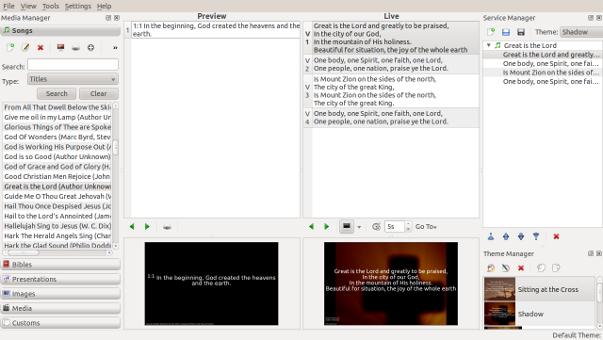
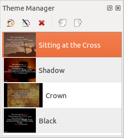

========
Glossary
========

The developers of OpenLP have strived to make it a straightforward and easy to
use application. However, it is good to be familiar with a few terms that will 
be used throughout this documentation, and when seeking support.

Main Window
-----------

The Main Window is what you will see when you first open OpenLP

The Main Window contains all the tools and plugins that make OpenLP function

Media Manager
-------------

The Media Manager contains a number of tabs the plugins supply to OpenLP.
Each tab in the Media Manager is called a **Media Item**

.. image:: pics/mediamanager.png

From the Media Manager you can send Media Items to the Preview or Live screens.

Preview 
-------

The preview pane is a section to preview your media items before you go live 
with them.

.. image:: pics/preview.png

Service File
------------

A service file is the file that is created when you save your service in OpenLP.
The service file consist of **Service Items**

Service Item
------------

Service items are the **media items** that are in the **service manager**

Service Manger
--------------

The service manager contains the media items in your service file. This is the 
area where your media items go live. You can also save, open, and edit 
services files from here.

.. image:: pics/servicemanager.png

Slide Controller
----------------

The Slide Controller controls which slide from a **Service Item** is currently
being displayed, and moving between the various slides.

.. image:: pics/slidecontroller.png

Theme Manager
-------------

The theme manager is where themes are created and edited. Themes are the text
styles and backgrounds that you use to personalize your services.

