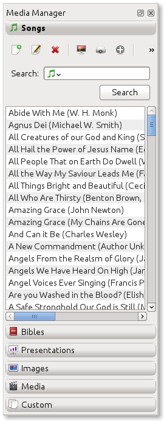

=============
Media Manager
=============

Once you get your system set up for OpenLP you will be ready to add content to
your Service Manager. This will all happen through the **Media Manager**. The
`Media Manager` contains all the Bibles, Songs, Presentations, Media, and 
everything else that you will project through OpenLP.

Enabling the Plugins
--------------------

You may need to enable the plugins that came with OpenLP. As you can see below
this is what the `Media Manager` looks like with all the plugins enabled.

To enable the plugins navigate to :menuselection:`Settings --> Plugins` or
press `F7`. You will want to click on the plugin to the left that you want to 
enable and select **active** from the drop down box to the right.

.. image:: pics/plugins.png

You are now ready to add content for your service.

Adding Media Content
--------------------

This section will describe how to add the different types of media OpenLP is 
capable of displaying.

Songs
^^^^^
Clicking on Songs in the Media Manager will display all of the songs you have 
added by Title and Author/Authors.

Using the buttons you can: 

`Add a song:` Brings up the dialog box to add a new song

`Edit the selected song:` Brings up the dialog box to make changes to the song

`Delete the selected song:` Removes the song from your song list

`Preview the selected song:` Lets you see what your song will look like 
displayed live

`Send the selected song live:` This option will immediately display your song 
live.

`Add the selected Song to the service:` This will enter your song in the Service 
Manager. You may also drag your song over to the Service Manager.

`Maintain the list of authors, topics and books:` Brings up a dialog box to edit 
Authors, Topics or Song Books. 
Note: Right clicking on a song file will bring up some of the same options.

Bibles
^^^^^^
Clicking on Bibles in the Media Manager will display your options for searching 
and adding chapters and verses to the Service Manager.

Using the buttons you can:

`Import a Bible:` This is discussed in detail on the Bible Importer page in the 
manual. 

`Preview the selected Bible:` Sends your selected verses to the Preview window 

`Send the selected Bible live:` This option will immediately display your 
selected verses live.

`Add the selected Bible to the service:` This will enter your verses into the 
Service Manager. You may also click and drag your verses over to the Service 
Manager. 

**Quick tab**

`Version:` Once you have imported a Bible, it will be displayed in the Version 
drop down box. Select the version of the Bible you want to use here.

**Second**

If you have “Display second Bible verses” selected in Configure OpenLP, Bibles 
tab, this choice will be visible. This option is for displaying another version 
of the Bible for comparison. Both versions will be displayed. If there is not 
enough space on one slide, the Second version will be displayed on the next 
slide.

Use the `Search` button to display your results in the box below.

**Find**

You will type your search query in this box for the following two searches.

`Search type:` You may search for a specific verse using this format below. 

Book Chapter 
Book Chapter-Chapter
Book Chapter:Verse-Verse
Book Chapter:Verse-Verse, Verse-Verse
Book Chapter:Verse-Verse,Chapter:Verse-Verse
Book Chapter: Verse-Chapter:Verse

`Text Search:`

You may also search by a keyword or words. The more words you use for the 
search, the more you will narrow down your results.

**Results** `Clear and Keep.`
 
Each search you make will display your verses below. If you would like to 
display verses that are out of sequence you may select `Keep` in the drop down 
box and continue your search for the next verse or verses. All searches will be 
shown and kept below. 
If you select `Clear` from the drop down box, each new search clears the 
previous search from the list below.

**Advanced tab**

This tab is convenient for selecting book, chapter and verse by name and number.
Version and Second are the same as in Quick tab above. Click on each box and 
select the version you wish to display and Second version if you wish to display 
an alternative version.

Use the `Search` button to display your results in the box below.

`Book:` Click on the drop down box and select the book you want to display. 
`Chapter: Verse:` Select your chapter From and To and Verse From and To

Results will work the same as the Quick tab above.

Presentations
^^^^^^^^^^^^^
Using the buttons you can:

`Load a new presentation:` This brings up a dialog box to find your presentation 
and list it in OpenLP.

`Delete the selected Presentation:` This removes your Presentation from the list. 
Please note: this will not delete the presentation from your computer, only from  
the OpenLP list.

`Preview the selected Presentation:` Sends your selected Presentation to the 
Preview window 

`Send the selected Presentation live:` This option will immediately display your 
selected Presentation live.

`Add the selected Presentation to the service:` This will enter your 
Presentation into the Service Manager. You may also click and drag your 
Presentation over to the Service Manager. 

Right clicking on a Presentation file will bring up some of the same options.

Images
^^^^^^
Using the buttons you can:

`Load a new Image:` This brings up a dialog box to find your Image and list it 
in OpenLP.

`Delete the selected Image:` This removes your Image from the list. Please note: 
this will not delete the Image from your computer, just the OpenLP list.

`Preview the selected Image:` Sends your selected Image to the Preview window 

`Send the selected Image live:` This option will immediately display your 
selected Image live.

`Add the selected Image to the service:` This will enter your Image into the 
Service Manager. You may also click and drag your Image over to the Service 
Manager. 

`Replace Live Background:` With an Image selected, clicking this button will 
immediately replace the live background being displayed with your selection.

Right clicking on an Image file will bring up some of the same options.

Media
^^^^^

Media is an audio or video file. Generally if you can play or view your media 
on your computer without OpenLP, you can also play it in OpenLP.

Using the buttons you can:
`Load a new Media:` This brings up a dialog box to find your Media and list it 
in OpenLP.

`Delete the selected Media:` This removes your Media from the list. Please note: 
this will not delete the Media from your computer, just the OpenLP list.

`Preview the selected Media:` Sends your selected Media to the Preview window 

`Send the selected Media live:` This option will immediately display your 
selected Media live.

`Add the selected Media to the service:` This will enter your Media into the 
Service Manager. You may also click and drag your Media over to the Service 
Manager. 

`Replace Live Background:` With a Media file selected, clicking this button will 
immediately replace the live background being displayed with your selection.

Right clicking on a Media file will bring up some of the same options.

Custom
^^^^^^

Custom gives you the option of creating your own slide. This could be useful for 
displaying readings, liturgy or any text that may not be found in Songs or 
Bibles.

`Add a new Custom:` Brings up the dialog box to add a new Custom display.
`Edit the selected Custom:` Brings up the dialog box to make changes to the 
Custom display.

`Delete the selected Custom:` Remove the Custom from your list

`Preview the selected Custom:` Lets you see what your Custom will look like 
displayed live

`Send the selected Custom live:` This option will immediately display your 
Custom live

`Add the selected Custom to the service:` This will enter your Custom in the 
Service Manager. You may also drag your Custom over to the Service Manager.

Right clicking on a Custom file will bring up some of the same options.

When you Add a new Custom slide a dialog box will appear. 

`Title:` Name of your Custom slide.

`Add:` After clicking on Add you will enter your text you want to display in 
this box. To create multiple slides, click the Split Slide button. When you have 
finished adding your text, click on the Save button.

`Theme:` Select the theme you want to use for your Custom slide from this drop 
down box.
`Credits:` Anything typed in this box will be displayed in the footer 
information on the display. When you are finished, click the Save button.

To Edit your slide, click on the Edit button to edit part of it or the Edit All 
if you need to make multiple changes. Use the Up and Down arrows to change the 
arrangement of your Custom slide.
