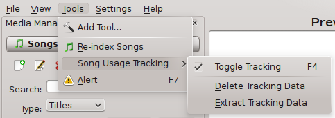
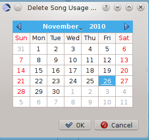
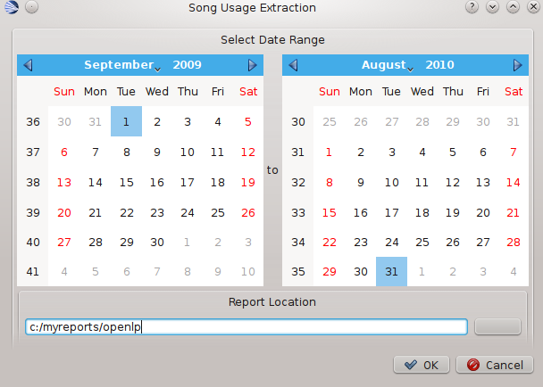

==========
Song Usage
==========

The Songusage plugin records the usage of Songs when they are used in a **Live**
situation. If the plugin is active all songs sent to the Live Service Manager
are recorded by this plugin. Once the plugin has been activated by the plugin
menu it can be turned on and off by use of the :guilabel:`F4` key or the
SongUsage menus.

The image below shows the menu items and how to access them.

Delete Tracking Data
^^^^^^^^^^^^^^^^^^^^
This option allows the removal of stored data use is no longer required.
Select the date you wish to remove data up to and press :guilabel:`Ok`.

This option is not reversable.

Extract Tracking Data
^^^^^^^^^^^^^^^^^^^^^
This option allows reports to be generated between any two dates.

The system automatically defaults to dates between the 1st September last year
and 31st August this year. The data is written to a file in the selected
directory.

The file name is **usage_detail_fromdate_todate.txt**.

The details extracted are:
  - Date item used
  - Time item used
  - Song Title
  - Song Copyright
  - Song CCLI.
