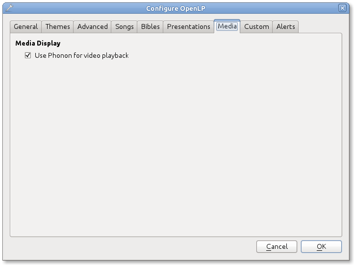
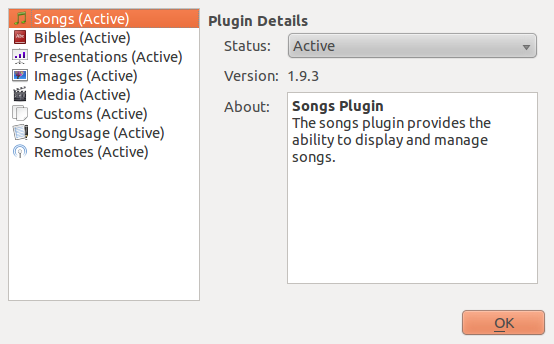

===============
Troubleshooting
===============

I can not play videos or other media
====================================

If you can not play video or audio through openlp, there are several areas that
could be an issue. First thing is to make sure you can play the media file 
through your default media player. OpenLP should be able to play any file that
you can play through your default media player.

If you can play a file through your media player but not on OpenLP it may help
to enable Phonon for multimedia playback. Go to the OpenLP configuration
:menuselection:`Settings --> Configure OpenLP...` and select the Media tab.
Make sure the check box for `Use Phonon for video playback` is checked.

Codecs
------

You may need to install codecs for certain files to play. Most newer versions 
of Windows and OS X will support most media types. Most Linux distributions 
will require a little more help to get certain media types to play.

Microsoft Windows
^^^^^^^^^^^^^^^^^

Later versions of Microsoft Windows (Vista, Windows 7) generally come with 
everything you need to play most media formats. If for some reason you need 
additional codecs we have seen success from the Combined Community Codec Pack
(CCCP): `<http://www.cccp-project.net/>`_.  You might also wish to check out the
K-Lite Codec Pack. If you are having issues, results do seem to vary with the 
different options. What works for some may not for others, so some trial and 
error may be required.

Mac
^^^

If you are using a Mac. You may wish to play Windows formats. flip4mac enables
you to use popular Windows formats such as .wmv on your Mac. You can get it 
here `<http://dynamic.telestream.net/downloads/download-flip4macwmv.htm>`_.

Ubuntu Linux (and variants)
^^^^^^^^^^^^^^^^^^^^^^^^^^^

If you are using Ubuntu Linux, or one of its variants (Kubuntu, Edubuntu, etc...)
it is a fairly quick and easy process to get all the codecs you need to make 
things work. You will need to install two meta-packages that contain all the 
multimedia codecs that you will generally need. From the Software Center install
ubuntu-restricted-extras and Kubuntu-restricted-extras, or from the terminal::
 
  user@linux:~ $ sudo apt-get install ubuntu-restricted-extras kubuntu-restricted-extras

**Note** if you are running Kubuntu there is no need to install the
ubuntu-restricted-extras meta-package

For more information on Ubuntu and multimedia issues please check out
`<https://help.ubuntu.com/community/RestrictedFormats/>`_.

Arch Linux
^^^^^^^^^^

The following command provides the most complete solution for codecs on Arch
Linux::
  
  root@linux:~ # pacman -S gstreamer0.10-{base,good,bad,ugly}-plugins gstreamer0.10-ffmpeg

If you need more help with Arch Linux and multimedia please see the Arch Linux
documentation at `<https://wiki.archlinux.org/index.php/Codecs>`_.

Debian Linux
^^^^^^^^^^^^

You will need to add the Debian Multimedia Repository. So add the folowing to
/etc/apt/sources.list::

  deb http://www.debian-multimedia.org testing main non-free

Then update the repository info::

  root@linux:~ # apt-get update

Then install the following packages::

  root@linux:~ # apt-get install gstreamer0.10-ffmpeg gstreamer0.10-lame gstreamer0.10-plugins-really-bad gstreamer0.10-plugins-bad gstreamer0.10-plugins-ugly gstreamer0.10-plugins-good gstreamer0.10-x264

Fedora Linux
^^^^^^^^^^^^
You will need to set up Fedora to play most media formats. This is relatively
simple using the rpmfusion repository. 

**Note** the following commands will enable a third party repository to your 
system. Please check out `<http://rpmfusion.org>`_. for more information.

To enable both the free and nonfree components for any Fedora official release
enter the following commands::

  su -c 'yum localinstall --nogpgcheck http://download1.rpmfusion.org/free/fedora/rpmfusion-free-release-stable.noarch.rpm http://download1.rpmfusion.org/nonfree/fedora/rpmfusion-nonfree-release-stable.noarch.rpm'

After enabling the rpmfusion repository you will want to refresh your package
list, perform any updates and search for gstreamer-good, bad, and ugly and
install.

Here is a good tutorial video on the rpmfusion repository 
`<http://www.linuxjournal.com/video/getting-mp3-support-fedora-using-rpmfusion-repositories>`_.

The Media Manager appears to be missing some features
=====================================================

If you do not see all the features listed in the Media Manager, you may need
to enable them. 

To enable the plugins navigate to :menuselection:`Settings --> Plugins` or
press :kbd:`Alt+F7`. You will want to click on the plugin to the left that you
would like to enable and select **active** from the drop down box to the right.

By default all plugins should be enabled during the first run wizard except the
remotes plugin, unless you specify differently.

I can not see the book, chapter, and verse when I display scripture
===================================================================

The book, chapter, and verse should be displayed when you display scripture. If
you can not see this your theme probably has the text size too small for the 
info to be seen. See the section of the manual on themes if you need more info
on text sizes in themes.

I am running Mac OS X and I do not have a presentations plugin
==============================================================

Due to software limitations with Keynote and OpenOffice Impress, the
presentations plugin on OS X is not currently available.

I am using PowerPoint 2010 or PowerPoint Viewer 2010 and presentations do not work
==================================================================================

Currently OpenLP does not support PowerPoint Viewer 2010. PowerPoint 2010 should
work correctly but there have been some issues when it does not work. If you 
have issues with PowerPoint 2010 or PowerPoint Viewer 2010 try PowerPoint 2003
or 2007 Viewer. Download the PowerPoint 2007 viewer for free here:
`<http://www.microsoft.com/downloads/en/details.aspx?FamilyID=048dc840-14e1-467d-8dca-19d2a8fd7485&displaylang=en>`_.

I have PowerPoint installed but it does not show as a presentation option
=========================================================================

Try installing the Visual C++ Runtime Redistributable you can find it here:
`<http://www.microsoft.com/downloads/en/details.aspx?FamilyID=9b2da534-3e03-4391-8a4d-074b9f2bc1bf&displaylang=en>`_

I have JPG images and they will not work on my system
=====================================================

This is a known issue on some Mac OS X 10.5 systems and on a few Windows XP 
systems. Currently the only solution is to convert your images into another
format. We would suggest using PNG images when possible with OpenLP.

I am running a Linux Distro and can not see the menus
=====================================================

This may be an issue with only XFCE the following commands have been known to 
resolve the problem::

  gconftool-2 --type boolean --set /desktop/gnome/interface/buttons_have_icons true
  
  gconftool-2 --type boolean --set /desktop/gnome/interface/menus_have_icons true

I chose to use a web Bible but it did not download the entire Bible
===================================================================

Due to copyright restrictions OpenLP cannot download an entire Bible. It can
only download the section you search for. If you do not have an internet 
connection where you intend to use OpenLP you will need to have another source
for scripture. For more information and options on acquiring bibles please see
:ref:`bibleimporter`.
