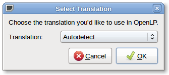
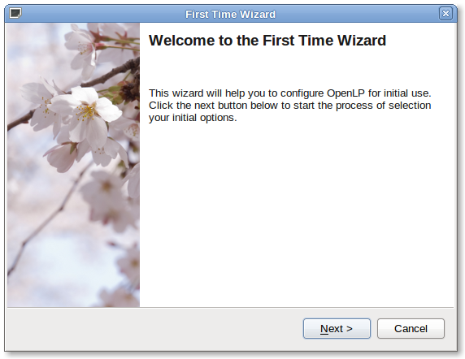
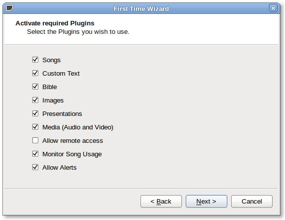
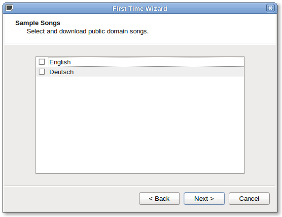
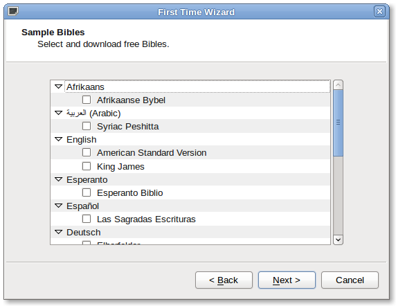
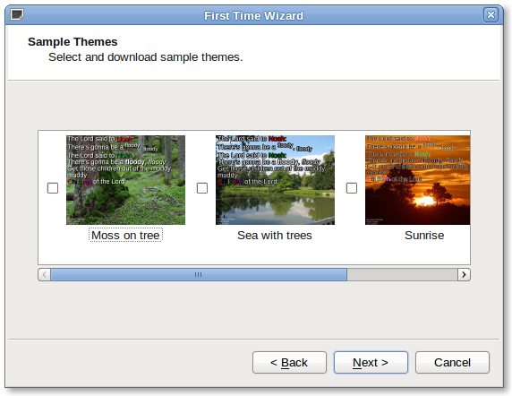
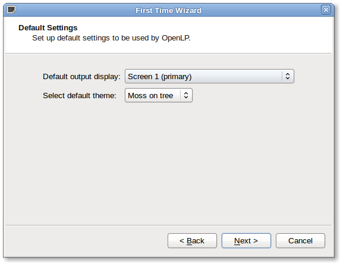
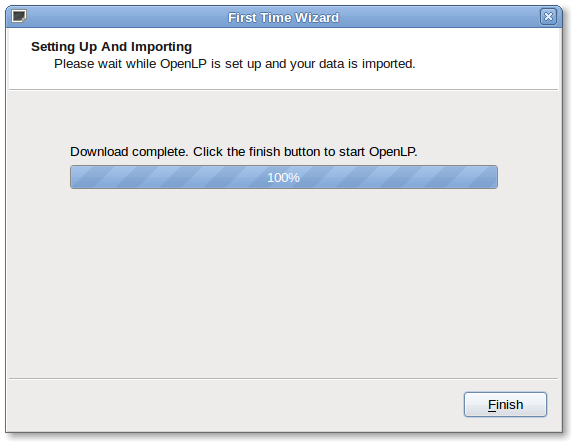

================
First Run Wizard
================

When using OpenLP for the first time, the **First Run Wizard** will help you 
with setting up your installation. This wizard is not intended to be a 
comprehensive setup but will help you with the basics for first time use.

**Select Translation**

You may choose the language translation you want to use or let OpenLP 
"Autodetect" it. Click OK after your selection.

The Welcome to the First Time Wizard dialog box will appear next. Click Next.

**Activate required Plugins**

OpenLP has many plugins you may choose to use. By default they are all checked 
except Allow remote access. These plugins are explained in detail in the manual 
under Media Manager. If you are not familiar with what the plugins provide, you 
should leave them checked and activated for your first time use. You may easily 
change your choice when OpenLP is running under Settings/Plugin List. Click Next.

**Sample Songs**

You may add Sample Songs to your song database. This is convenient if you are a 
new user and would like to see how the songs appear in the database and are 
formatted. If you already have songs in your database, adding these samples will 
not overwrite your database. You may check the box for English or Deutsch and 
click Next.

**Sample Bibles**

OpenLP comes with a number of free Bibles you may install. Click the box next to
the Bible you wish to install. If none of these Bibles meet your needs, you may
continue on without selecting any of them by clicking Next.

**Sample Themes**

You may add Sample Themes by checking the box next to the theme. As with the 
songs, this is useful if you are a new user and would like to see how the themes
are formatted. You can easily delete the themes at a later time if you do not 
have a use for them. Click Next.

**Default Settings**

`Default output display`
If you are connected to your projector or second monitor you will want to select
Screen 2. If you are installing OpenLP and not connected at this time, you may 
change this in Configure OpenLP under the General tab. 

`Select default theme`
This box gives you the option of selecting your default theme. If you do not 
have any themes, you will not be able to make the selection. Click Next.

`Setting Up`

OpenLP will now setup the software with the selections you have chosen. Click 
Finish and OpenLP will start.