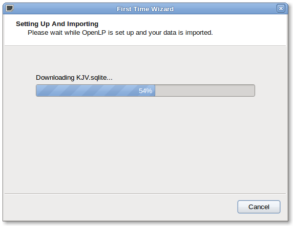
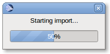
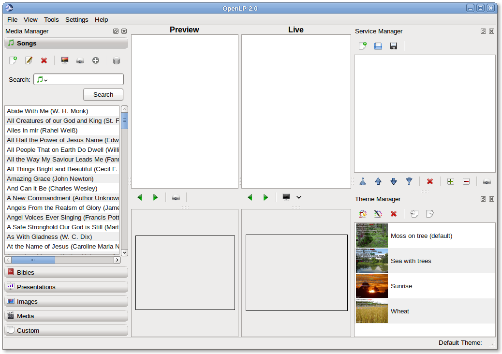

================
First Run Wizard
================

When using OpenLP for the first time, the **First Run Wizard** will help you 
with setting up your installation. This wizard is not intended to be a 
comprehensive setup but will help you with the basics.

Select Translation
------------------

.. image:: pics/001-first-time-language.png

You can choose the translation you want to use or let OpenLP 
automatically select it based on your operating system locale. Click 
:guilabel:`OK` to continue.

The "Welcome to the First Time Wizard" dialog box will appear next. Click 
:guilabel:`Next`.

.. image:: pics/002-first-time-wizard-welcome.png

Activate required Plugins
-------------------------

.. image:: pics/003-first-time-wizard-plugins.png

OpenLP has several plugins to choose from. By default, all plugins are enabled, 
except the *Remote Access* plugin. For more information on these plugins, please 
read the :doc:`mediamanager` section in the manual. If you are not sure of which 
plugins to enable or disable, leave the selection as-is. You can easily activate 
or deactivate plugins later, when OpenLP is running, by going to 
:menuselection:`Settings --> Plugin List`. Click :guilabel:`Next` to continue.

Sample Songs
------------

.. image:: pics/004-first-time-wizard-songs.png

OpenLP provides some sample songs in a few languages for downloading and 
importing into your new song database. This is convenient for new users who do 
not have any songs yet. If you already have songs in your database, OpenLP will 
simply add these sample songs to your database, leaving your existing songs 
intact. Once you are happy with which songs you'd like, click :guilabel:`Next`.

Sample Bibles
-------------

.. image:: pics/005-first-time-wizard-bibles.png

There are also a number of free Bibles that you can download and install. Using 
the check box next to each Bible, select each Bible that you would like 
installed. If you do not wish to install any Bibles, simply leave them all 
unchecked. Once you are happy with your selection, click :guilabel:`Next` to 
continue.

Sample Themes
-------------

.. image:: pics/006-first-time-wizard-themes.png

Some sample themes are also available for download and installation into OpenLP. 
As with the Bibles, simply check the check box next to each theme to select it. 
If you are a new user, these themes can help you understand how themes work. If 
you are happy with your selected themes, click :guilabel:`Next` to continue.

Default Settings
----------------

.. image:: pics/007-first-time-wizard-settings.png

Default Display Monitor
^^^^^^^^^^^^^^^^^^^^^^^

Screen 2. If you are installing OpenLP but are not connected to a second output 
at the time, you can set this up later by going to 
:menuselection:`Settings --> Configure OpenLP`.

Default Theme
^^^^^^^^^^^^^

If you have selected one or more themes on the themes page of the wizard, you 
can select which theme you'd like to be the default theme.

If you are happy with the selections you have made, click :guilabel:`Next` to 
continue to the next page.

Making progress.

.. image:: pics/010-first-time-wizard-finished.png

On the last page of the wizard, OpenLP will download the sample songs, Bibles 
and themes, and set up OpenLP for you. Click :guilabel:`Finish` and OpenLP will 
start.

The main window.

