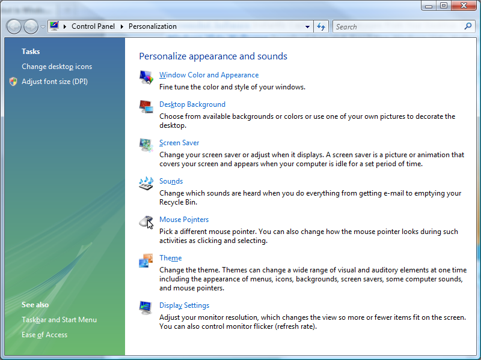
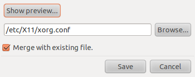

==================
Dual Monitor Setup
==================

The first step in getting OpenLP working on your system is to setup your
computer properly for dual monitors. This is not very difficult, but the steps 
do vary depending on operating system.

Most modern computers do have the ability for dual monitors. To be certain
check your computer's documentation. A typical desktop computer capable of dual
monitors will have two of, or a combination of the two connectors below.

**VGA**

.. image:: pics/vga.png

**DVI**

.. image:: pics/dvi.png

A laptop computer setup only varies slightly, generally you will need only one
of outputs pictured above since your laptops screen serves as one of the 
monitors. Sometimes with older laptops a key stroke generally involving the FN
key and another key is required to enable the second monitor on laptops.

Some computers also incorporate the use of S-Video or HDMI connections.

A typical OpenLP set up consist of your normal single monitor setup, with your
projector setup as the second monitor. With the option of extending your
desktop across the second monitor, or your operating system's equivalent.

Microsoft Windows
-----------------

Dual monitor setup is similar among all the currently supported Windows
releases (XP, Vista, Windows 7), but does vary slightly from one release to the
next.

Windows 7
^^^^^^^^^

Windows 7 has using  a projector in mind. Simply connect your projector and 
press the **Windows key and tap P**.

The more traditional way is also fairly straight forward. Go to the control 
panel and click on display. This will open up the Display options. You can 
also bypass this step by right click on a blank area on your desktop and 
selecting **resolution**.

.. image:: pics/winsevendisplay.png

Then click on the Screen Resolution from the left pane.

.. image:: pics/winsevenresolution.png

Then enable your projector and ensure your desktop is extended.

Windows Vista
^^^^^^^^^^^^^

From the control panel click on personalize, or right click a blank place on
the desktop and click personalization. 

From the **Personalization** window click on Display Settings.

.. image:: pics/vistadisplaysettings.png

Then enable the montior that represents your projector an make sure your
you have checked Extend the desktop.

Windows XP
^^^^^^^^^^

From the control panel select Display, or right click on a blank area of the 
desktop and select properties. From the properties window click on the settings
tab.

.. image:: pics/xpdisplaysettings.png

Then enable the monitor that represents your projector an make sure your
you have checked Extend the desktop.

Linux
-----

Due to the vast varieties of hardware, distributions, desktops, and drivers
this is not an exhaustive guide to dual monitor setup on Linux. This guide
assumes that you have properly set up any proprietary drivers if needed. You
should seek out your distributions documentation if this general guide does not
work.

GNOME 
^^^^^

This guide is for users of the GNOME desktop who do not use proprietary drivers.
From most distros go to System --> Preferences --> Display Settings (Monitors)

.. image:: pics/gnome.png

Setup your projector with the correct resolution and make sure you do **not**
have mirrored desktop enabled (same image on all monitors).

KDE
^^^

This guide is for users of the KDE desktop who do not use proprietary drivers.
From most distros click the Kick Off menu and navigate to **system settings**

.. image:: pics/kdesystemsettings.png

Click on the display and monitor icon.

.. image:: pics/kdedisplay.png

From here you will need to set up your projector with the appropriate
resolution, and position. OpenLP works best projecting to the monitor on the
right.

Linux Systems Using Nvida Drivers
^^^^^^^^^^^^^^^^^^^^^^^^^^^^^^^^^

This guide is for users of the proprietary Nvidia driver on Linux Distributions.
It is assumed that you have properly setup your drivers according to your
distribution's documentation, and you have a working xorg.conf file in place.

If you wish to make the changes permanent in setting up your system for dual
monitors it will be necessary to modify your xorg.conf file. It is always a good
idea to make a backup of any cirtical file before making changes. 

  user@linux:~ $ sudo cp /etc/X11/xorg.conf /etc/X11/xorg.conf.old 

or for those using systems that use the root user instead of sudo, change to 
root and enter
  
  root@linux: # cp /etc/X11/xorg.conf /etc/X11/xorg.conf.old 

The exact location of the xorg.conf file can vary so check your distribution's 
documentation.

If you want to make your changes permanent run Nvidia settings from the terminal

  user@linux:~ $ sudo nvidia-settings 

or

  root@linux: # nividia-settings 

If you do not want to write the changes to your xorg.conf file simply run the
Nvidia Settings program from your desktops menu, usually in an administration
or system menu, or from the terminal as a normal user run

 user@linux:~ $ nvidia-settings 

Once you have opened Nvidia Settings, click on **X Server Display Confiuration**
Then select the monitor you are wanting to use as your second monitor and click
configure.

.. image:: pics/nvlinux1.png

After clicking configure, select twinview. Then click ok.

.. image:: pics/twinview.png

Then click **apply** and if you are happy with the way things look click to keep
your new settings. Don't worry if all goes wrong the settings will return back
to the previous settings in 15 seconds without any action. Nvidia Settings
should take care of selecting your optimum resolution etc, but that can be 
changed as needed. When you are happy with everything click on **Save to X Configuration File**

Then click **Save** and you should be set. You may want to restart X or your 
machine just to make sure all the settings carry over the next time you log in.

